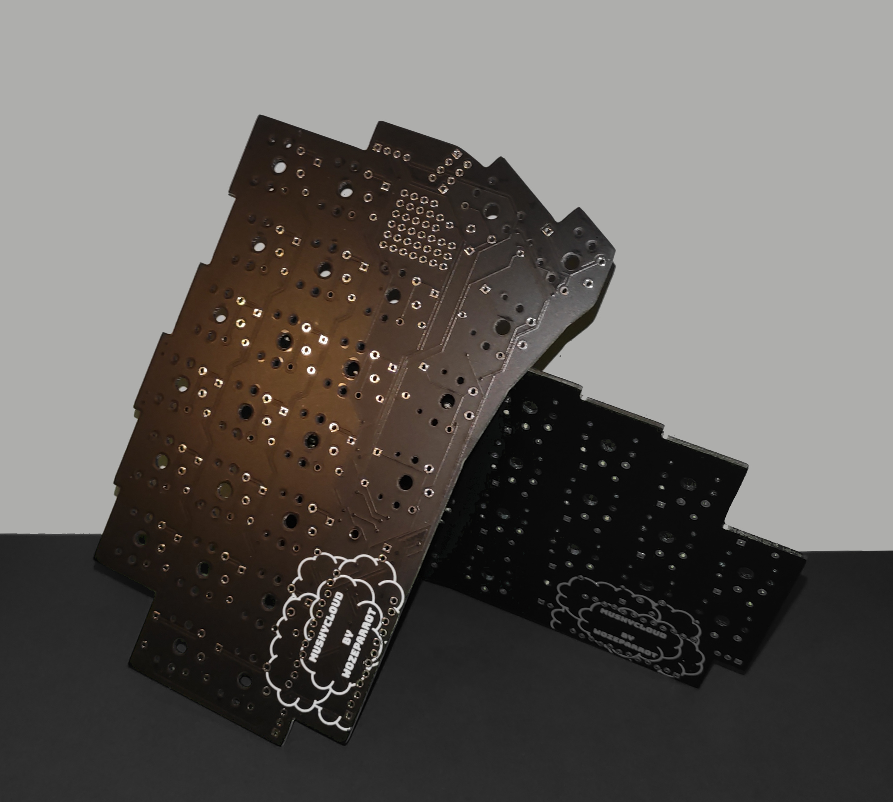

# MushyCloud

A low profile 48 key ergonomic split keyboard.

Designed for Kailh choc switches to be super low profile.
Designed to be fairly modular, with optional OLED, encoder, and RGB LED strips.

## Building

### Parts

Most of these parts can be sourced from AliExpress or local vendors.

- 2x PCB
- 2x Pro Micro
- 2x 1x4 2.54 mm right angle pin header
- 48x Kailh Choc switches
- 48x 1N4148 diodes
- (Optional) 1x 0.96" OLED

### Assembly

Assembly is fairly straightforward.

The PCBs are designed to be reversible, so the same PCB will be used for both halves.

The following steps are for one half of the keyboard. Just repeat for the other half.

1. Solder the diodes to the top side of the PCB.
2. The switches should "clip" into the PCB. Basically just clip a switch in then solder the pins.
3. Solder a right angle pin header to the top side of the PCB.
4. Solder the Pro Micro to the top side of the PCB. On the left half, the Pro Micro should be right side up. On the right half, the Pro Micro should be upside down.
5. (Optional) Solder the OLED to the left side of the PCB only. The OLED goes just below the pin header on the bottom set of pins.

### Flashing

Uses a custom fork of QMK. See [here](https://github.com/wozeparrot/qmk_firmware).

Depending on your USB cable, it may be slightly difficult to get the USB cable to plug into the Pro Micro on the right half.

Flashing QMK is the same as any other split keyboard that uses QMK.
