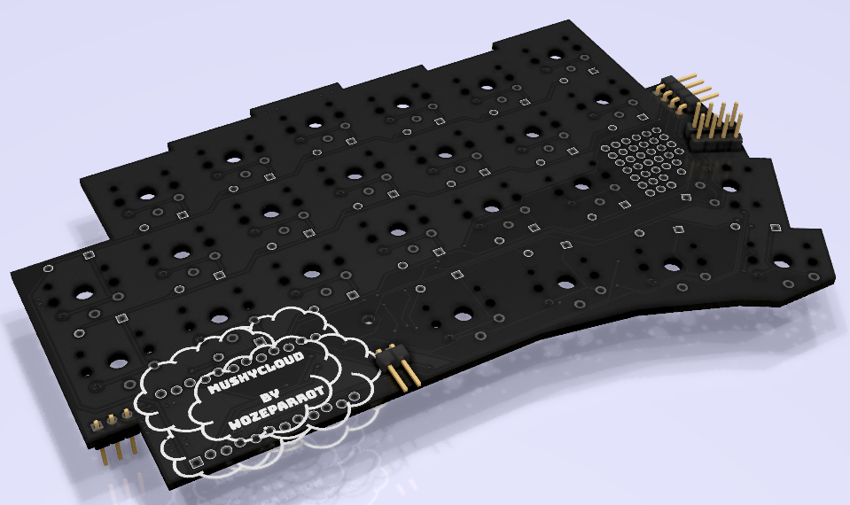

# MushyCloud

Low profile 48 key ergonomic split keyboard.

Designed for Kailh choc switches to be super low profile.
Designed to be fairly modular, with optional OLED, encoder, and RGB LED strips.

